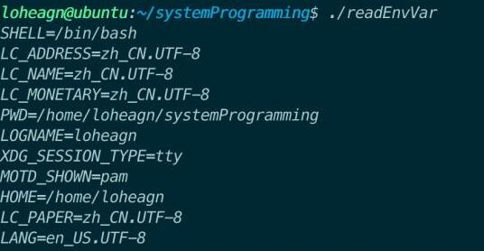

# Lab03a: 权限 & 重定向 & 管道 & 环境变量

[TOC]

## 实验目的

掌握 Linux 中用户及文件的权限管理、重定向、管道等命令行使用技巧，了解并操作环境变量。

## 实验指南

### Linux 权限

（以下关于文件的内容在下一章：文件 I/O 操作中会再次涉及）

#### 从`ls -l`说起

当你使用`ls -l`命令的时候, 会发现列出了目录的很多信息，并且以行为单位，下来就认识一下这些文件的基本含义。
首先 `-l` 选项代表`ls (- long)` 就是展示目录下的详细信息。 比如如下例子：

```shell
[me@linuxbox ~]$ ls -l
total 56
drwxrwxr-x 2  me  me  4096  2007-10-26  17:20  Desktop
drwxrwxr-x 2  me  me  4096  2007-10-26  17:20  Documents
drwxrwxr-x 2  me  me  4096  2007-10-26  17:20  Music
drwxrwxr-x 2  me  me  4096  2007-10-26  17:20  Pictures
drwxrwxr-x 2  me  me  4096  2007-10-26  17:20  Public
drwxrwxr-x 2  me  me  4096  2007-10-26  17:20  Templates
```

- 第一个字段 10 个字符表示这个文件的类型和权限，其中第一个字符表示该文件的类型，其余九个字符表示权限。第一个字符的函数如下：

  - `-`: 表示普通文件
  - `d`: 表示目录
  - `l`: 表示链接文件
  - `p`: 表示管理文件
  - `b`: 表示块设备文件
  - `c`: 表示设备文件
  - `s`: 表示套接字文件

  其余九个字符表示这个文件的详细权限，三个字符为一组 ，总共有三组，分别代表了拥有者，拥有组，其他人对这个文件的权限。三组属性分为三段：`\[rwx]\[rwx][r-x]`，其中：

  - **r**（Read，读取权限）：对文件而言，具有读取文件内容的权限；对目录来说，具有浏览目录的权限；
  - **w**（Write，写入权限）：对文件而言，具有新增、修改文件内容的权限；对目录来说，具有删除、移动目录内文件的权限；
  - **x**（eXecute，执行权限）：对文件而言，具有执行文件的权限；对目录来说，该用户具有进入目录的权限。
  - `-`：对应的字符为-表示没有该权限

- 第二个字段表示该文件硬连接的数目。这里表示都是 2。
- 第三个和第四个字段 分别表示所有人和所有组，这里表示拥有人和拥有组都是`me`
- 第五个字段表示以字节数表示的文件大小。
- 第六个字段表示最后修改时间。
- 第七个字段表示文件名。UNIX 系统本身不要求文件名中有扩展名，但 GCC 等应用程序要求源代码文件有扩展名，比如 C 语言源文件的扩展名为`.c`，以用来区别不同编程语言编写的源程序。

#### 用户及用户组

Linux 用户分为**管理员**和**普通用户**，普通用户又分为**系统用户**和**自定义用户**。可以查看`/etc/passwd`来查看；

- 系统管理员：即 root 帐户，拥有所有系统权限，是整个系统的所有者。
- 系统用户：Linux 为满足自身系统管理所内建的账号，通常在安装过程中自动创建，用于区分以其身份所运行的应用程序的权限，不用于登录操作系统。
- 自定义用户：由 root 管理员创建，供用户登录系统进行操作所使用的账号，用于区分不同的用户身份。

在 Linux 中的每个用户必须属于一个组，不能独立于组外。在 Linux 中每个文件有所有者、所在组、其它组的概念。用户组的信息我们可以在`/etc/group`中查看。

用户组是具有相同特征用户的逻辑集合。简单的理解，有时我们需要让多个用户具有相同的权限，比如查看、修改某一个文件的权限，一种方法是分别对多个用户进行文件访问授权，如果有 10 个用户的话，就需要授权 10 次，那如果有 100、1000 甚至更多的用户呢？

显然，这种方法不太合理。最好的方式是建立一个组，让这个组具有查看、修改此文件的权限，然后将所有需要访问此文件的用户放入这个组中。那么，所有用户就具有了和组一样的权限，这就是用户组。

将用户分组是 Linux 系统中对用户进行管理及控制访问权限的一种手段，通过定义用户组，很大程度上简化了对用户的管理工作。

#### 权限操作命令

- `su`: 切换到`root`，`root`账户具有最高权限。返回当前用户则使用`exit`。
- `sudo`: 在指令前加上`sudo`，使得本条指令以最高权限运行。
- `chmod`: 使用 `chmod`命令更改文件权限。
- `chown`: 使用`chown`命令更改文件所有者。
- `chgrp`: 使用`chgrp`命令更改文件的所属组。
- `useradd`, `groupadd`: 添加用户/用户组 格式为 `useradd/groupadd [选项] 用户名`
- `passwd`: 给用户设置密码。格式为`passwd [选项] 用户名`
- `userdel`, `groupdel`: 删除用户 格式为 `userdel/groupdel [选项] 用户名`
- `usermod`, `groupmod`: 用以修改用户和用户组的相关属性

如果具体的命令格式不记得了，可使用 `help` 或 `man` 命令获取提示信息。 大多数 GNU 工具都有`--help` 选项，用来显示工具的一些信息，用法。注意：`help` 命令**只能显示 Shell 内部的命令帮助信息**。 通过 `man` 指令可以查看 Linux 中的指令帮助、配置文件帮助和编程帮助等信息。`man` 查到的信息比 `help` 详细。

### 重定向

Linux 中默认输入输出分为 3 个文件：

- 标准输入`stdin`。标准输入文件的编号是`0`**(牢记 Linux 万物皆文件，可以用文件表示设备)**，默认的设备是键盘，命令执行时从键盘读取数据。
- 标准输出`stdout`。标号为`1`，默认的设备是显示器，命令的输出会被打印到屏幕上。
- 标准错误`stderr`。标号为`2`，默认的设备是显示器，命令执行产生的错误信息会被发送到标准错误文件。

重定向的意思就是改变这三个文件实际指向，比如我们希望从某个文件中获取输入，那么就需要将标准输入指向这个文件。重定向后命令依然从标准输入获得输入，此时标准输入指向这个文件，故命令能够从这个文件获取输入。

- 输入重定向
  格式为`命令 < 文件名`，比如 `sort < sp.txt` , 把`sp.txt`文件中的内容作为`sort`的输入。
- 输出重定向
  格式为`命令 > 文件名`，比如 `cat /etc/passswd > ps.log`，`cat`会输出`/etc/passwd`中内容，但此时并不会输出到屏幕上，而是输出到`ps.log`中。
- 错误重定向
  格式为`命令 2> 文件名`，比如 `gcc -c test.c -o test.out 2 > error.log`，如果`gcc`编译时出现错误，则会把错误信息输出到`error.log`中。会覆盖原文件中内容，`>>` 则会将输出追加到原文件末尾。
- 其他
  - 在重定向错误时使用了错误文件的编号`2`，其实在输入输出的时候也可以显式写`0`或`1`，通常是省略。
  - `&`运算符，表示等同于：`2>&1`，表示将标准错误从重定向到标准输出指向的文件。如 `1>/dev/null` ，然后执行`2>&1`，此时都指向空设备。

### 管道

管道作用是将多个命令串连起来，使一个命令的输出作为另一个命令的输入。

格式为`命令1 | 命令2 | 命令3 ....| 命令n`。

比如`ls /etc | grep init`将会输出`/etc`目录下，文件名包含`init`的文件/目录。如果不使用管道，命令就得拆成: `ls /etc > tmp grep init < tmp rm tmp ls /etc | grep init >> test cat test`。

其实管道是一种进程之间通信的手段，在之后的 Linux 系统编程的实验中我们还会经常遇到。

### 环境变量和可执行文件

#### 环境变量

环境变量可以简单理解为，在程序运行所处的环境中，提前设定好的参数值。程序在执行过程中，会去读取这些提前设定好的参数值。

举个例子，大家在 Windows 中安装完 jdk 时，双击安装完安装包后，都要去修改`JAVA_HOME`、`CLASSPATH`、`PATH`这三个环境变量。其中当时这个`JAVA_HOME`我们设定的是一个目录，这样，当有软件需要使用 jdk 的时候，它就会尝试读取这个`JAVA_HOME`的值，从而知道系统安装的 jdk 在哪里。

Linux 默认存在的环境变量有`PATH`、`HOME`等，我们可以通过下面的命令查看：


有没有发现对环境变量的引用与我们在 shell 脚本中引用变量的方法完全一样？因为它本质上就是已经提前定义好的变量嘛！

#### 设定或者修改环境变量

在 Windows 中，我们一般是直接使用 GUI 界面修改，然后重启就可以了。但在 Linux 必须使用命令行操作。

总的来说，在 Linux 中设定环境变量的语法很简单：

```bash
export environment_variable=xxxxx
```

比如：


很简单吧？

但是你会发现，当你退出当前的 Terminal，再次打开一个新的 Terminal 时，将无法再次访问`system_programming`。这是因为，我们上次进行的修改，是在一个 bash 的进程中修改的，当我们关闭 Terminal，就终止了这个进程；当再次启动一个新的 Terminal 时，就重新开启了一个新的进程，这个新的进程自然是访问不到别的进程的变量的。（关于进程的概念，后续学习中会有介绍）。

那该如何“永久”设置环境变量呢？我们知道，当一个 bash 进程启动时（即，打开一个 Terminal 或者远程 SSH 登录时），该进程会读取`~/.bashrc`文件来完成初始化。因此，我们只需要把上面提到的`export`语句写到`~/.bashrc`文件中就可以了。注意，该文件前面加了`.`，也就是说这是一个隐藏文件，要使用`ls -a`才能看到。


当然，这种方法只能使得当前用户，也就是我们自己访问到该环境变量，对于 root 用户，或者其他注册用户来讲，是访问不到的。为了达到所有用户都可以访问的效果，我们可以把`export`语句写到`/etc/profile`文件，当系统启动时会读取到该文件。

#### 使用 C 语言读取环境变量

可以使用全局变量`environ`获取所有的环境变量：

```c
# include <stdio.h>
extern char** environ;
int main(int argc, char const* argv[]) {
    char** p = environ;
    for (; *p != NULL; p++) {
        printf("%s\n", *p);
    }
    return 0;
}
```

输出大概如下图所示：



还可以使用函数`getenv()` 返回特定的环境变量的值：

```c
#include <stdio.h>
#include <stdlib.h>

int main(int argc, char const *argv[]) {
    const char* envName = "SHELL";
    printf("$SHELL = %s\n", getenv(envName));
    return 0;
}
```

执行结果如下：


#### “可执行文件”

Linux 中“可以被执行的文件”分为两种，一种是二进制文件，一般是 ELF 格式的，其中包含机器指令和数据，操作系统可以直接解析这种文件，把相应的代码段和数据段加载到内存中执行。我们用 gcc 编译产生`a.out`就是这种文件。

还有一种是脚本文件，这种文件是文本文件。所谓的脚本文件，指的是该文件中是一条条的指令，操作系统在执行该脚本文件的时候，会用一种解释器（bash、Python 等）来**逐行解释执行**该文件中的指令。大家在前几周学习 bash shell 编程的时候，写的就是这些脚本文件。操作系统使用什么解释器来执行该脚本文件，是需要**人为来指定**的（当不指定时，使用不同的 shell 会有不同的策略）。这种指定可以是这样的：

```bash
bash test.sh
```

表示使用 bash 解释器来解释执行 test.sh，大家运行 Python 文件的时候使用`python test.py`，跟这个道理是相同的。（**请始终注意，文件拓展名大多数情况下都是给人看的，操作系统不会自动把`.py`结尾的文件看做是 Python 文件，你同样可以把一个 bash 脚本保存成`test.py`这样的名称，只不过这容易给人造成误解而已**）。

还有一种指定解释器的方法，就是在脚本文件的第一行通过注释的方式指明所使用的解释器。就像下面这样：

```bash
#! /bin/bash

echo 'Linux is cool!'
```

这样，在执行该文件的时候，就不需要手动指定解释器了，只需要输入该文件的名称就可以了。但一般这个时候执行这个文件会报错，类似于：

```bash
-bash: ./test.sh: Permission denied
```

咦，明明是我创建的这个文件，我再来执行它为啥会“Permission denied（没有权限）”呢？这时候查看一下这个脚本文件的权限：

```bash
-rw-rw-r-- 1 loheagn loheagn 27 Apr 28 21:33 test.sh
```

发现了吧？该文件确实没有可执行的权限。

这时，我们使用`chmod`来修改文件权限就可以了，例如可以：

```bash
chmod 764 test.sh
```

或者直接：

```bash
chmod +x test.sh
```

#### PATH

相信大家在上学期的硬件基础课程中已经知道在 bash shell 中怎么执行一个程序了。比如，当大家在工作目录中使用 GCC 编译出来了一个可执行文件`a.out`，要运行这个程序的时候是这样进行的：

```bash
./a.out
```

或者，直接

```bash
a.out
```

这两个都是一样的，都是**直接在 shell 中输入了要执行的文件的文件名**。而且正如上一小节所看到的，执行脚本文件也是直接输入文件名。这是在 bash shell 中执行可执行文件的唯一方式。

但如果我们不在这个可执行文件所在的目录下怎么办？如果我在一个其他目录下，想执行这个程序，就需要用相对路径或绝对路径写出整个路径前缀，这往往是一件非常麻烦的事情。这时候，`PATH`就诞生了。

`PATH`是一个环境变量，这个环境变量指明了**系统默认**的查找可执行文件的路径。你可以在 bash shell 中使用`echo $PATH`打印出你当前的`PATH`，它将如下所示：

```bash
/usr/local/sbin:/usr/local/bin:/usr/sbin:/usr/bin:/sbin:/bin:/usr/games:/usr/local/games:/snap/bin
```

这一行输出实际上是几个路径之间用`:`拼接起来的。

有了`PATH`，当你在命令行输入一个程序名时，bash shell 就会去`PATH`所指定的这几个目录中去寻找该程序，如果找不到就会报错。

现在大家知道了吧，我们平常使用的指令`ls`、`mv`等指令没啥神奇的，他们只不过是操作系统预设好的一个个程序，并放在了`PATH`指定的某个路径下，我们输入指令时，其实就相当于是在执行这些程序。

比如，我们可以用`which`来查看这些“内置程序”的具体路径：


大家可以去路径`/usr/bin`下去查看验证一下。

## 实验习题

- 对一个文本文件`file.txt`执行命令：`#chmod 746 file.txt`。请解释该命令的含义并写出执行该命令后该文件的权限信息。(注：这里的`#`表示在管理员权限下完成，并不是命令的前缀。在 Shell 中`#`前缀会被当作注释，从而无效)
- 假设系统中有两个用户，分别是 A 与 B ，这两个人共同支持一个名为 `project` 的用户组。假设这两个用户需要共同拥有`/srv/ahome/`目录的开发权，且该目录不许其他人进入查阅，请问该目录的权限配置应如何配置，写出配置所需的指令。并在你的机器上验证。（提示：请在 `/srv`下创建`/ahome`目录，并创建用户 A ， B ，用户组`project` ，并给 `/ahome`赋予合理的访问权限。）
- 请写出命令`who | wc -l`的结果并分析其执行过程。
- 解释以下命令`sh test && cat a.txt || cat b.txt >f1 <f2 2>&1`'若命令执行到最后一个 `cat b.txt`,`f1`中的内容为`b.txt`的内容还是`f2`的内容
